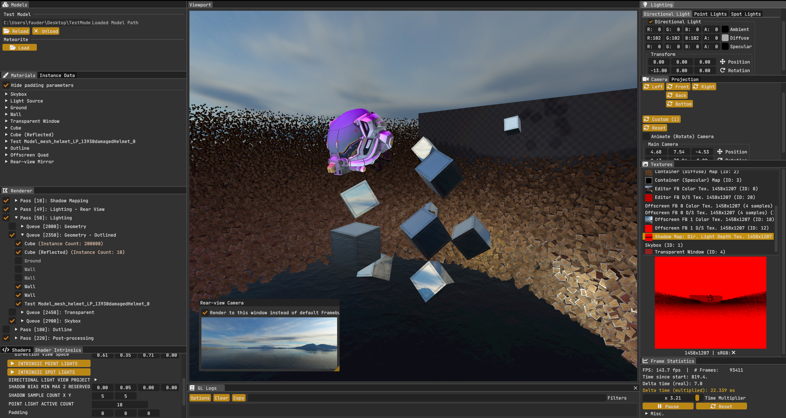

# Kakadu

  

## What is it?

It is a graphics framework I'm developing, to study graphics programming topics.

(This project supersedes the https://github.com/fauder/OpenGL-Framework project, which is no longer maintained.)

## Credits
- To get up to speed with OpenGL, I use:
  - [Joey de Vries](https://learnopengl.com/About)'s awesome [OpenGL tutorial series](https://learnopengl.com).
  - [Cherno](https://github.com/TheCherno)'s awesome [OpenGL tutorials on YouTube](https://www.youtube.com/playlist?list=PLlrATfBNZ98foTJPJ_Ev03o2oq3-GGOS2).
  - [Cem Yuksel](https://www.youtube.com/@cem_yuksel)'s awesome ["Introduction to Computer Graphics" playlist on YouTube](https://www.youtube.com/playlist?list=PLplnkTzzqsZTfYh4UbhLGpI5kGd5oW_Hh) on YouTube.
  - [Cem Yuksel](https://www.youtube.com/@cem_yuksel)'s awesome ["Interactive Computer Graphics" playlist on YouTube](https://www.youtube.com/playlist?list=PLplnkTzzqsZS3R5DjmCQsqupu43oS9CFN) on YouTube.
- The book [3D Math Primer for Graphics and Game Development](https://gamemath.com) (along with various other sources) was used as the basis for math algorithms & classes.
- [letheoblivion](https://www.artstation.com/letheoblivion)'s awesome Kakadu icon is used as the engine's main icon.
- [stb_image](https://github.com/nothings/stb/blob/master/stb_image.h) from the [stb](https://github.com/nothings/stb) library was used for texture i/o.
- [stb_include](https://github.com/nothings/stb/blob/master/stb_include.h) from the [stb](https://github.com/nothings/stb) library was used to integrate #include support for shaders.
- [Dear ImGui](https://github.com/ocornut/imgui) is used for the user interface.
- [GLFW](https://www.glfw.org/) is used for windowing & other platform-specific needs.
- [GLAD](https://github.com/Dav1dde/glad) is used as the loader for OpenGL functions.
- [fastgltf](https://github.com/spnda/fastgltf) is used to load .gltf models.
- [RenderDoc](https://renderdoc.org/) is used for analyzing/debugging graphics bugs.
- [kenney](https://kenney.nl/)'s awesome assets are used (currently for prototype textures)
- [glslang](https://github.com/KhronosGroup/glslang) is used for offline validation of GLSL shaders as a Visual Studio post-build step.
- [JetBrains Mono](https://www.jetbrains.com/lp/mono/) is used as the font for ImGui.
- [Font Awesome](https://github.com/FortAwesome/Font-Awesome) is used as the icon font for ImGui.
- [IconFontCppHeaders](https://github.com/juliettef/IconFontCppHeaders) is used for accessing icons in icon fonts via simple C++ headers.
- [Google Fonts' Archivo Black](https://fonts.google.com/specimen/Archivo+Black) is used for the text in the banner image.

## License

The source code in this repository is licensed under the Apache License 2.0. See the [LICENSE](LICENSE) file for details.

The icon image [app_icon.ico](Engine/Engine/Asset/Icon/app_icon.ico) is proprietary and may not be used, copied, modified, or distributed without explicit permission. See the [Engine/Engine/Asset/Icon/LICENSE](Engine/Engine/Asset/Icon/LICENSE) file for more information.
